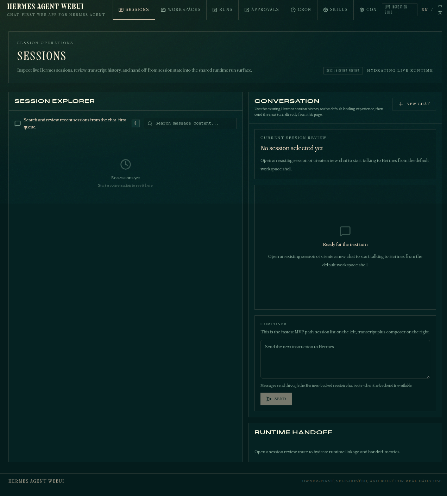

# Hermes Agent WebUI

[](https://github.com/laolaoshiren/hermes-agent-webui/actions/workflows/ci.yml)
[](https://github.com/laolaoshiren/hermes-agent-webui/actions/workflows/pages.yml)
[](https://github.com/laolaoshiren/hermes-agent-webui/releases)

Hermes Agent WebUI is a chat-first web app for Hermes Agent.

It is being built to beat the current default choices for Hermes on the dimensions normal people actually feel first:
- a clearer chat experience
- safer public deployment
- better day-to-day owner workflow
- easier switching between sessions, workspace, and agent activity

This project is not trying to replace Hermes core.
It is trying to become the best serious web frontend for Hermes.

## Why this exists

Today, Hermes users mostly choose between:
- the official built-in web/admin surfaces
- Open WebUI connected through the Hermes API server
- community WebUI projects like `nesquena/hermes-webui`

Those options already prove there is real demand for a strong Hermes web frontend.

Our goal is to ship a frontend that is:
- chat-first instead of control-panel-first
- owner-first instead of enterprise-heavy
- public-deployable with real auth and sane defaults
- modern enough to attract contributors, not just end users

Current packaging status:
- first public alpha release is live: `v0.1.0-alpha.1`
- CI is active
- GitHub Pages deployment workflow is wired up and being brought online

## Try the demo

Public demo status:
- GitHub Pages deployment workflow is live and being activated
- Current public alpha release: `v0.1.0-alpha.1`
- Until the public demo URL is attached, use the screenshots, release page, and active workflow badges as the live progress surface



What to expect right now:
- the UI is moving quickly
- rough edges are expected during active incubation
- public-ready auth and deployment are the next visible product layer

## What you should expect right now

Already real:
- session list and session hydration path
- chat-oriented sessions surface
- config/env/cron/skills integration path
- Hermes-backed MVP adapter for session/chat flows
- roadmap / architecture / devlog / CI discipline

Still actively being transformed:
- app shell is being refocused from control-center framing to chat-first product framing
- public-safe auth and deployment flow
- stronger workspace panel and runtime stream UX
- better GitHub presentation with screenshots, demo polish, and contributor onboarding

## Product direction

Primary product priorities:
1. chat-first session workflow
2. workspace-aware Hermes usage
3. owner-first secure deployment
4. contributor-friendly modern stack
5. fast iteration in a standalone repo, with stable pieces upstreamed later when proven

## Local development

```bash
npm install
npm run backend:mvp
npm run dev
```

By default Vite proxies `/api` and `/v1` to `http://127.0.0.1:9119`.

## MVP backend adapter

```bash
cd /root/hermes-agent-webui
npm run backend:mvp
```

Current adapter endpoints:
- `GET /api/status`
- `GET /api/sessions`
- `GET /api/sessions/:id/messages`
- `POST /api/session/new`
- `POST /api/chat`
- `DELETE /api/sessions/:id`

The current adapter shells out to the installed `hermes` CLI for replies and stores adapter session state under `~/.hermes/control-center-mvp/`.

## Build checks

```bash
npm run build
npm run lint
npm run typecheck
```

## Repository conventions

- `docs/DEVLOG.md` records continuous project activity in public, human-readable form.
- `docs/ROADMAP.md` captures staged execution.
- `docs/ARCHITECTURE.md` records system boundaries and design constraints.
- `docs/plans/` contains implementation plans detailed enough for parallel subagents.

## Current competitive strategy

The near-term goal is simple:
- copy what users already love from strong Hermes web frontends
- fix the pain points they still complain about
- build original advantages around public-safe deployment, owner-first flow, and cleaner product UX

## Fast feedback loop

If you try the project and hit a problem, open an issue immediately:
- bug report: `https://github.com/laolaoshiren/hermes-agent-webui/issues/new/choose`
- feature request: `https://github.com/laolaoshiren/hermes-agent-webui/issues/new/choose`

Current operating principle:
- ship fast
- let users touch the product early
- fix visible problems quickly
- keep the public repo looking alive and responsive

## Inspirations

Primary inspirations and lessons incorporated into this project:
- Hermes official web/admin surfaces
- Open WebUI
- nesquena/hermes-webui
- OpenClaw
- Poco
- Mission Control
- OpenHands
- LibreChat
